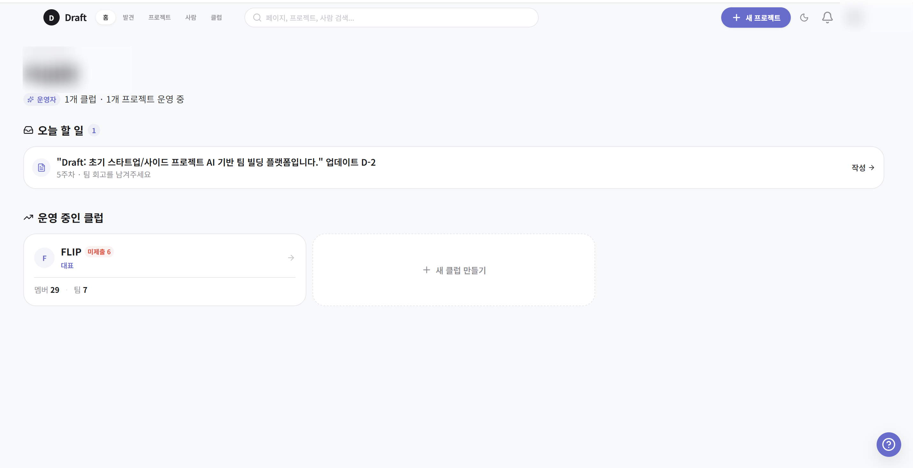
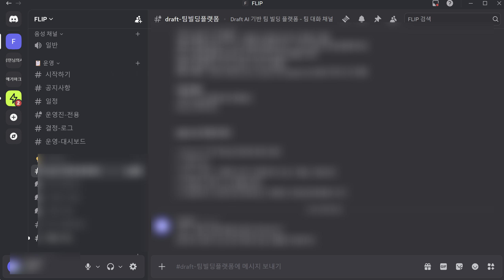
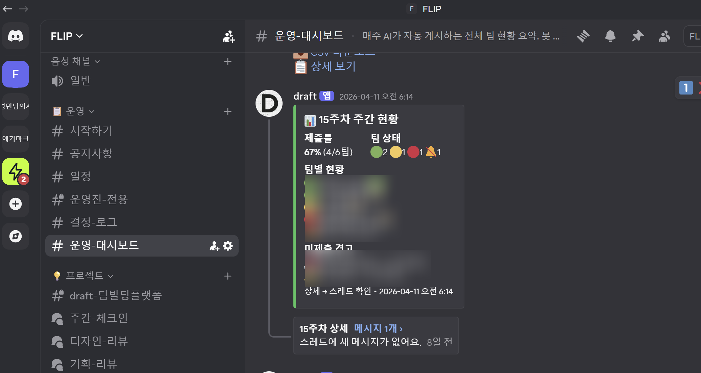
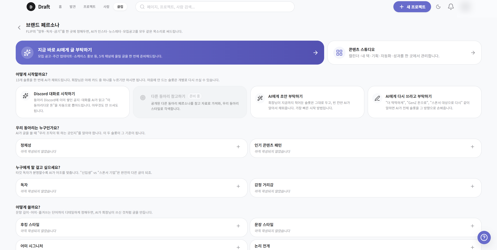
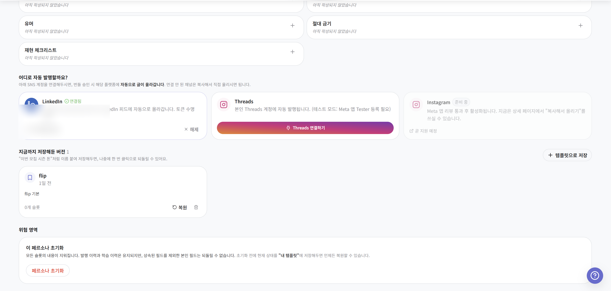
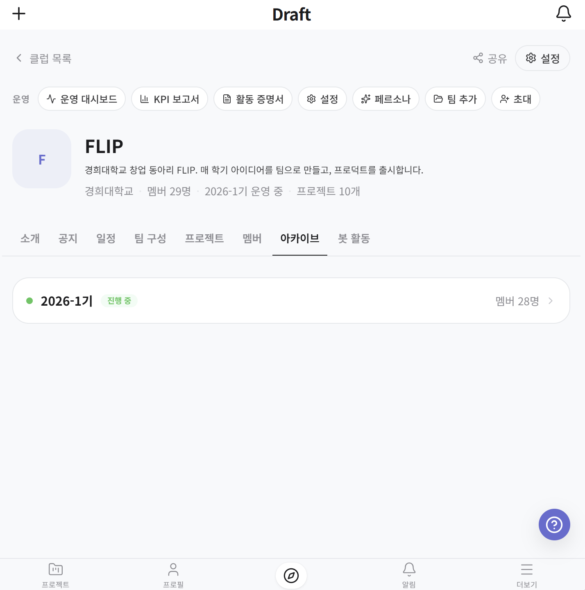
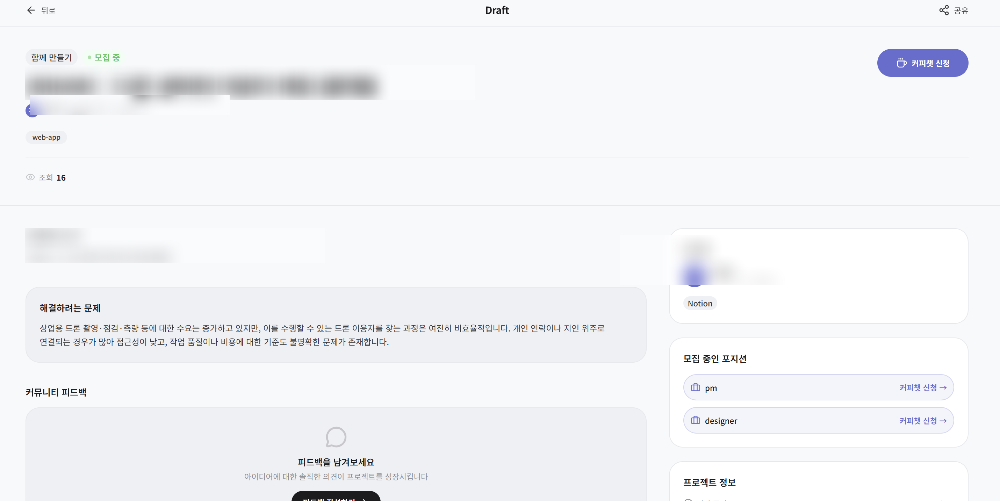
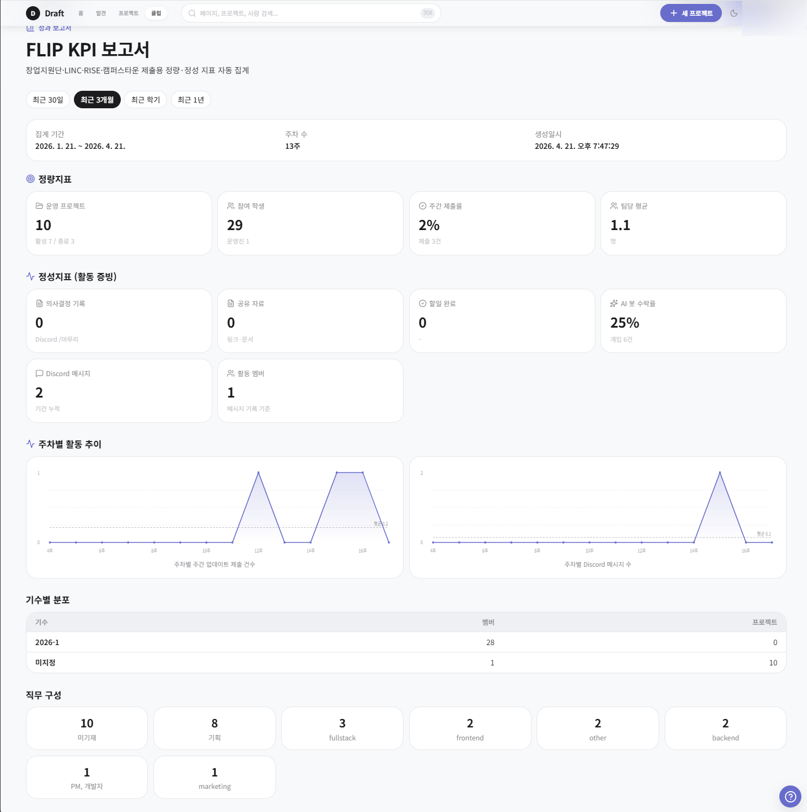
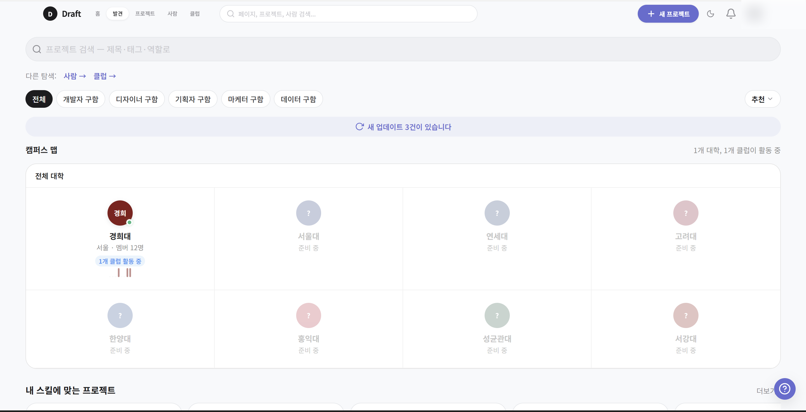

# 별첨 — Draft 소개 자료

본 제안의 프로그램 2 "창업 툴 케이스 스터디" 에서 주요 사례로 다루게 될 Draft 에 대해, 본문에 담기 어려웠던 맥락을 별도로 정리한 문서입니다. 이 서비스가 대체 무엇이고 왜 FLIP 회장이 직접 만들고 있으며, 경희대와 어떤 접점이 있을 것 같은지 — 이 세 가지를 가볍게 전달드리는 것이 목적입니다. 본문과 마찬가지로 러프 스케치이고, 구체화는 담당 선생님과의 대화에서 함께 해나가면 좋겠습니다.

---

## Draft 가 무엇인가

Draft 는 대학교 동아리·학회의 운영을 돕는 서비스입니다. 창업동아리만을 위한 도구는 아니라고 보고, 학술동아리·프로젝트 팀·일반 중앙동아리까지 폭넓게 대상으로 삼고 있습니다. 다만 창업시대에는 학술동아리 역시 실제로는 창업 후보자 풀이라고 생각하고 있어서, 이번 경희대 파트너십에서는 그 중 창업과 가장 가까운 동아리 유형부터 먼저 시범해보는 흐름입니다.

핵심은 Slack·카톡·Discord 같은 기존 소통 채널을 대체하려는 것이 아니라, 그 채널들 위에서 오가는 대화와 활동이 흩어지지 않고 기수별 기록과 주간 업데이트로 자연스럽게 쌓이도록 돕는 쪽에 있습니다. 운영은 Draft 에, 소통은 원래 쓰시던 곳에. 이 분리가 Draft 의 가장 기본적인 사용법이라고 봅니다.

---

## 실제 화면과 사용 흐름

운영진이 Draft 안에서 어떤 흐름으로 움직이게 되는지 화면과 함께 간단히 정리했습니다. 담당 선생님께서 직접 dailydraft.me 에 들어가 보실 수도 있지만, 담당자용 기관 뷰는 별도 권한이 필요해서 여기에 미리 일부를 옮겨둡니다.

### 1. 운영진 대시보드 — 가장 먼저 보이는 화면

로그인 직후 보이는 화면입니다. 소속 동아리의 이번 주 진행 상황, 승인 대기 중인 초안, 최근 활동 요약이 한눈에 정리됩니다. 회장·총무 같은 운영진이 "이번 주 뭐가 진행 중이지?" 를 파악하는 출발점 화면이라고 봅니다.

### 2. Discord 활동이 이렇게 정리됩니다

동아리 Discord 서버를 연결해두면 채널별 대화량·활발한 기여자·주제 흐름이 요일별로 정리됩니다. 평소에는 흘러가 버리는 대화가 주간 단위로 "이 주에 이런 활동이 있었다" 는 기록으로 남는 부분입니다. 이 데이터가 그대로 다음 단계(주간 업데이트 초안) 의 재료가 됩니다.

### 3. AI 가 주간 업데이트 초안을 써줍니다

Discord 활동·GitHub 커밋·승인된 공지를 묶어 AI 가 주간 업데이트 초안을 써주는 화면입니다. 운영진은 이 초안을 검토하고 수정만 하면 됩니다. 실제로 총무가 주간 보고서를 0부터 쓰던 시간이 검토·수정 시간으로 줄어드는 지점이고, FLIP 에서 가장 먼저 체감하게 될 기능 중 하나라고 생각합니다.

### 4. 외부 채널 자동 발행 — 페르소나 엔진

동아리의 톤·스타일을 학습시켜두면, 승인된 글을 Threads·Instagram·LinkedIn 같은 외부 채널에 자동 발행합니다. 아래는 Threads 에 실제 올라간 체인 예시 화면입니다.

운영진 승인 없이는 어떤 글도 외부 발행되지 않도록 구성되어 있습니다. 자동화라는 단어 때문에 오해가 있을 수 있어 이 점은 특히 유의해두었습니다.

### 5. 기수별 아카이브와 공개 포트폴리오

동아리가 세대 교체되어도 이전 기수의 활동이 URL 로 그대로 남습니다. 새로운 회장이 와도 "지난 학기에 뭘 했는지" 를 검색하는 대신 한 화면에서 바로 볼 수 있습니다. 학교 입장에서도 특정 동아리의 역사가 연속으로 확인되는 자료가 됩니다.

공개 설정된 동아리들의 주간 기록이 한 피드로 흐르게 됩니다. 학내에서 "지금 누가 어떤 활동을 활발히 하고 있는가" 가 자연스럽게 드러나는 공간이라고 보시면 될 것 같습니다.

### 6. 기관용 KPI 리포트 — 담당 선생님께서 가장 관심 가지실 부분

센터 담당자용 뷰는 소속 동아리들의 활동량·멤버 변화·주간 리포트를 종합한 지표 화면입니다. 학기말 실적 보고에 곧바로 들어갈 수 있는 형태로 내려받을 수 있고, 개별 동아리의 운영진 변경·중요 결정 같은 이벤트도 감사 로그로 함께 쌓입니다. 이 부분이 본문 2부에서 말씀드린 "후속 기록 부족" 고민에 대한 직접적인 대응이라고 생각합니다.

### 7. 학내 탐색

학교 안에서 활동 중인 창업가·팀·동아리를 한 화면에서 탐색할 수 있습니다. 센터 담당자가 "지금 실제로 움직이는 학생이 누구인가" 를 파악하실 때 참고하실 수 있는 뷰입니다.

---

## 왜 경희대에서 만들어지고 있는가

Draft 는 외부 스타트업이 만든 서비스가 아니라, FLIP 10-1대 회장이 FLIP 운영 중에 겪는 고민을 스스로 풀기 위해 만들고 있는 프로덕트입니다. 그러다보니 FLIP 과 Draft 는 동일 인물이 운영하는 "테스트 베드"와 "도구"로 엮여 있고, FLIP 에서 겪은 불편이 Draft 의 다음 기능 우선순위가 되는 구조입니다.

개인적인 방향을 솔직하게 말씀드리면, 중기적으로는 이 아이템이 경희대 창업 생태계 안에서 실제 창업 케이스로 이어지면 좋겠다는 생각입니다. 그런 의미에서 이번 파트너십이 단순히 한 번의 프로그램 지원으로 끝나는 것이 아니라, 센터 입장에서는 소속 재학생 창업가의 실적 케이스로, 학생 입장에서는 초기 단계부터 학교와 같이 호흡을 맞추는 출발점이 되었으면 좋겠다는 생각입니다.

---

## 경희대 창업교육센터와의 접점

본문에서 말씀드린 세 가지 고민 — 창업 인재 풀이 얕다는 것, 창업팀 후속 기록이 부족하다는 것, 재사용 가능한 기록물이 잘 남지 않는다는 것 — 각각에 대해 Draft 가 어느 정도 도움이 될 수 있지 않을까 생각하는 지점을 간단히 적어둡니다. 단정하는 건 조심스럽고, FLIP 시범 운영에서 같이 확인해나가면 좋겠습니다.

첫 번째 고민에 대해서는, 이미 검증된 학생 창업 풀이 Draft 위에 가시적으로 쌓이게 됩니다. 누가 어떤 프로젝트를 끌어가고 있는지, 학생의 활동 히스토리가 공개 프로필과 피드에 정리되기 때문에, 센터 담당자가 "지금 실제로 움직이는 학생이 누구인가" 를 보다 가볍게 파악하실 수 있을 것 같습니다. 개인정보는 물론 학생이 명시적으로 공개 동의한 범위에서만 기관 쪽으로 연결됩니다.

두 번째 고민, 후속 기록 부분은 Draft 가 원래부터 주간 업데이트를 자동으로 모으는 구조라서, 개별 창업팀이 Draft 를 쓰기만 하면 기관 대시보드에 요약이 따라 쌓입니다. 나중에 학기말 실적 보고에 곧바로 들어갈 수 있는 형태로 내려받을 수 있을 것이라 봅니다.

세 번째, 기록물 부분은 본 파트너십에서 납품드리기로 한 리포트 5편이 Draft 의 자동 드래프트 기능을 통해 제작되기 때문에, 담당 선생님 입장에서는 FLIP 이 쓰는 도구 자체가 기록물을 만들어 납품하는 원천이 되는 흐름입니다. 동아리가 세대 교체되어도 기록물은 URL 로 남고, 차년도 기획 자료로 바로 연결된다고 생각합니다.

---

## 지금 단계에서 부탁드리고 싶은 것

크게 세 가지로 묶어서 말씀드립니다. 첫째는 담당 선생님과의 인터뷰 한 번입니다. 제가 지금 만들고 있는 방향이 센터의 실제 업무 맥락과 얼마나 맞는지, 어디가 더 필요한지에 대한 의견을 직접 듣고 반영하고 싶습니다. 30분 정도면 충분합니다.

둘째는 FLIP 시범 운영 기간 동안의 지원과 관찰입니다. 이번 5~6월 파트너십 프로그램에서 FLIP 이 Draft 를 쓰며 운영하게 될 텐데, 그 과정을 센터가 언제든 들여다보고 피드백 주실 수 있는 관계였으면 좋겠습니다. 필요하다면 학내의 다른 창업 동아리를 소개해주시는 것도 큰 도움이 될 것 같습니다.

셋째는 중기적으로 학교 차원 도입 여부에 대한 판단입니다. 시범 운영 결과와 센터 피드백이 쌓인 뒤에, 경희대 안에서 몇 개 동아리 수준으로 확대해볼 수 있을지, 아니면 아직 이른 단계인지 같이 판단해주셨으면 좋겠습니다. 이 부분은 서두를 생각은 없고, 시범의 결과가 근거로 쌓인 뒤에 자연스럽게 이어지면 좋겠다고 봅니다.

장기적으로는 경희대가 Draft 의 첫 협력 대학으로 이름이 남게 되는 그림도 조심스럽게 생각하고 있습니다. 다만 이것은 시범과 인터뷰가 의미 있게 진행됐을 때 얘기이고, 지금 단계에서 드리는 부탁은 앞의 세 가지에 한정합니다.

---

## 부록 — 기본 정보

서비스 도메인은 https://dailydraft.me 이고, 개인정보처리방침·이용약관·데이터 삭제 안내·시스템 상태 페이지 모두 같은 도메인 하위에 공개되어 있습니다. 대학·기관 계약에 필요한 기본적인 보안·개인정보 처리(개인정보보호법 준수, 감사 로그, 시스템 상태 공개 등)는 이미 프로덕트 단계에 맞는 수준으로 준비하고 있다고 보시면 될 것 같습니다. 더 상세한 실사 자료는 필요하신 단계에 별도로 드리겠습니다.

운영·개발은 FLIP 10-1대 회장 이성민이 맡고 있습니다. 연락은 team@dailydraft.me 또는 평소 연락 드리던 chadolmin01@khu.ac.kr 둘 중 편하신 주소로 부탁드립니다. 본 별첨에 대한 피드백이든 인터뷰 일정 조율이든 편하게 답 주시면 감사하겠습니다.

---

*본 문서는 러프 스케치입니다. 담당 선생님의 피드백을 받아 구체화해나갈 예정입니다.*

FLIP 회장 이성민 — 2026년 4월
